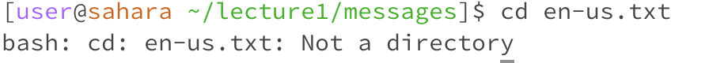

cd command
1. an example of using the command with no arguments.

  

  when the cd command run, there has not any changing
  
  if cd comment with no argument, cd command can not do anything.
  
  this output is not error. it is no different
  
2. an exmaple of using the command with a path to a directory as an argument.

  

  when the cd command run, directory is change from home to lecture1.
  
  cd command is used to change to different directory. When it is no argument, cd can not do anything.
  
  this output is not error. it is successfully changed original directory to different directory.
  

3. an example of using the command with a path to a file as an argument.

  

    when the cd command run, directory is working on the message.
    
    the output is shows error, because the cd command can not use on file.
    
    this output is not error.

  

