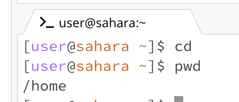
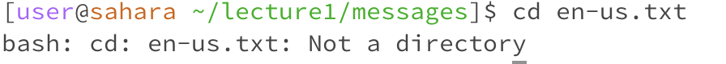
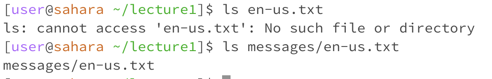
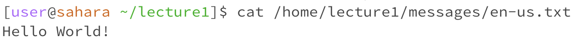

cd command
1. an example of using the command with no arguments.

  

    when the cd command with no arguments is run, there has not any changing
  
    if cd comment with no argument, cd command can not do anything.
  
    this output is not error. it is no different
  
2. an exmaple of using the command with a path to a directory as an argument.

  

    when the cd command with a path to a directory as an argument is run, directory is change from home to lecture1.
  
    cd command is used to change to different directory. When it is no argument, cd can not do anything.
  
    this output is not error. it is successfully changed original directory to different directory.
  

3. an example of using the command with a path to a file as an argument.

  

    when the cd command with a path to a file as an argument is run, directory is working on the message.
    
    the output is shows error, because the cd command can not use on file.
    
    this output is not error.

ls command

  1. an example of using the command with no arguments.

       

    when ls command with no arguments is run, directory is root.

    when ls command with no argument, it will shows all the directories and files.
  
    it is not error, it is successfully show out all directories and a path to a directory as an argument.

     
  2. an exmaple of using the command with a path to a directory as an argument.

       

     when ls command with a path to a directory as an argument, directory is lecture1.

     when ls command with a path to a directory as an argument, it will shows all the file that in the directory.

     it is not error, it is successfully show out all files.

     
  3. an example of using the command with a path to a file as an argument.

       

     when ls command with a path to a file as an argument, directory is lecture1.

     ls command only show out the directory and files.

     it is not error.

cat command

  1. an example of using the command with no arguments.

     

     when cat command with no arguments is run, directory is root.

     cat command only read the parameters that in the file.

     it is not error.

  3. an exmaple of using the command with a path to a directory as an argument.

     

     when cat command with a path to a directory as an argument, directory is lecture1.

     cat command can not read the directory.

     it is not error.

     
  5. an example of using the command with a path to a file as an argument.

     

     when cat command with a path to a file as an argument, directory is lecture1.

     cat command read the parameters that in the file and output.

     it is not error

