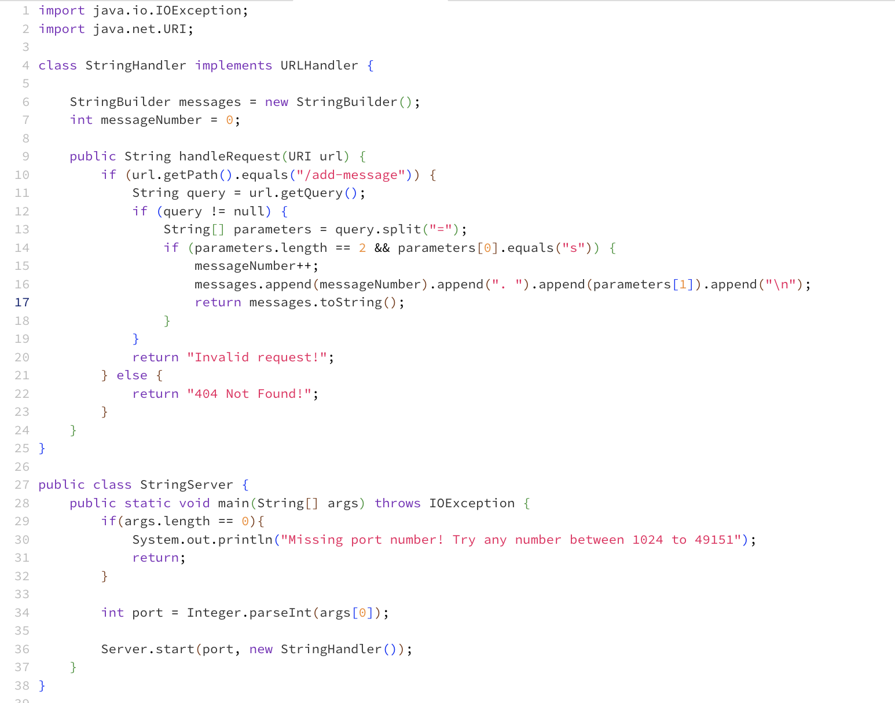
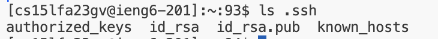
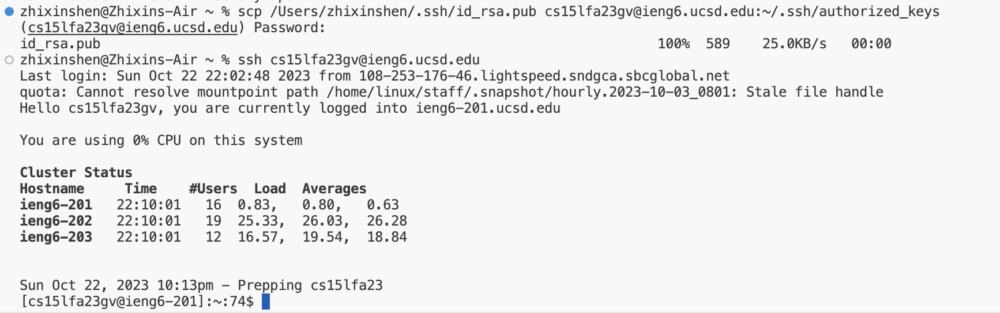

Part1:

for a request to /add-message?s=Hello, the handleRequest method is called with a URI argument representing the request URL. The messageNumber   field is incremented from 0 to 1, and the messages field is updated from an empty string to "1. Hello\n". The method returns the messages string, which is sent as the response. The state of the StringHandler changes due to the messageNumber increment and the new message being appended to messages.

for a request to /add-message?s=How are you, the handleRequest method is called with a URI argument representing the request URL. The messageNumber field is incremented from 1 to 2, and the messages field is updated from "1. Hello\n" to "1. Hello\n2. How are you\n". The method returns the messages string, which is sent as the response. The state of the StringHandler changes due to the messageNumber increment and the new message being appended to messages.

Part 2:

Part 3:
this my firt time to engagement with Java, server operations, and SSH, I understanding of advanced Java features, network security principles, and server management.  
