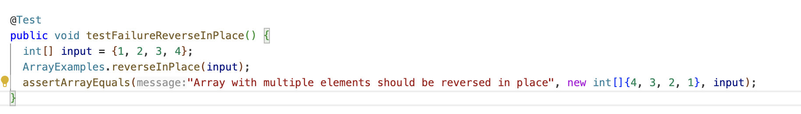
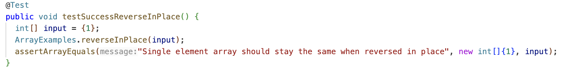
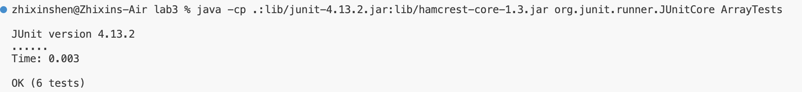
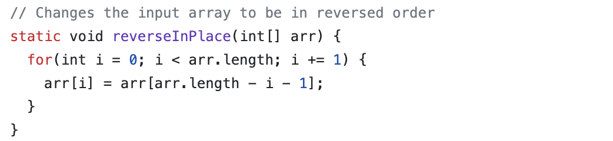
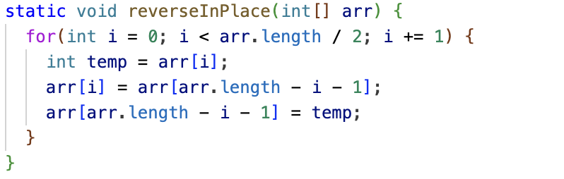
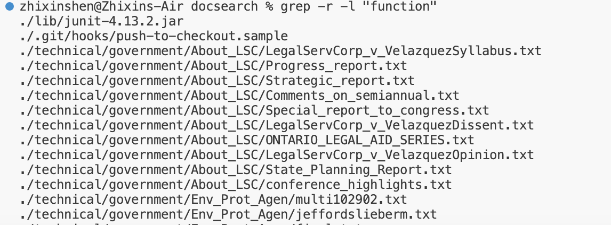
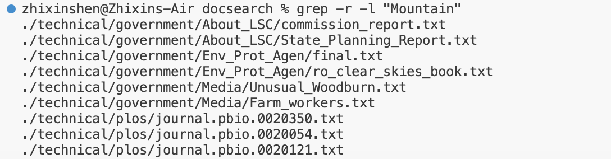

Part 1:

A failure-inducing input for the buggy program：

An input that doesn’t induce a failure:

The symptom:

before:

after:

fixed the issues:

The fix corrects the loop to iterate only up to the midpoint of the array. By doing so, each element is only swapped once with its corresponding element from the other end of the array. The use of a temporary variable temp to hold the value of the element being swapped. This change ensures that the array is correctly reversed in place.

Part2:
grep -r -l:

This command recursively searches for the word "deprecated" in all files within the ./technical directory.

