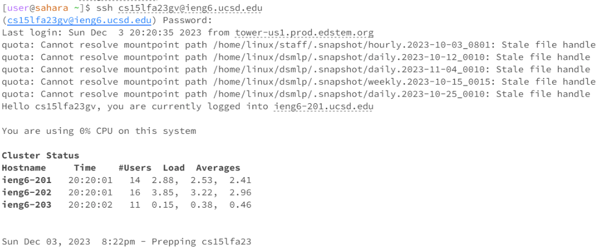
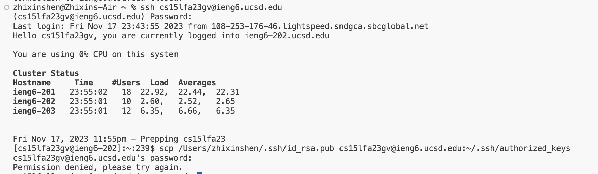
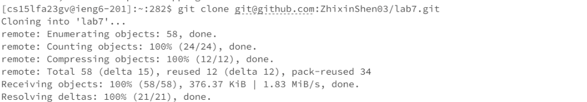
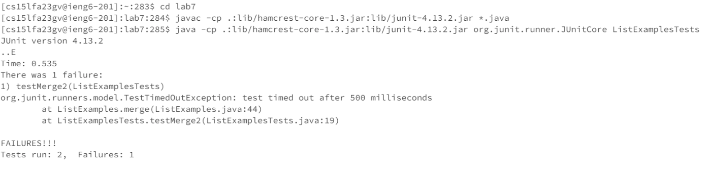
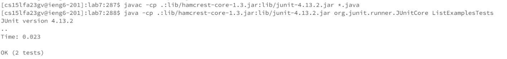
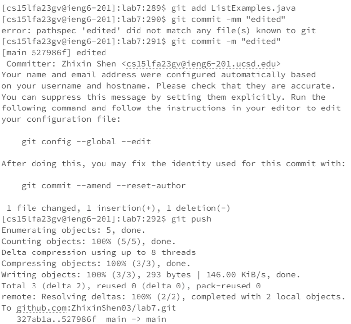
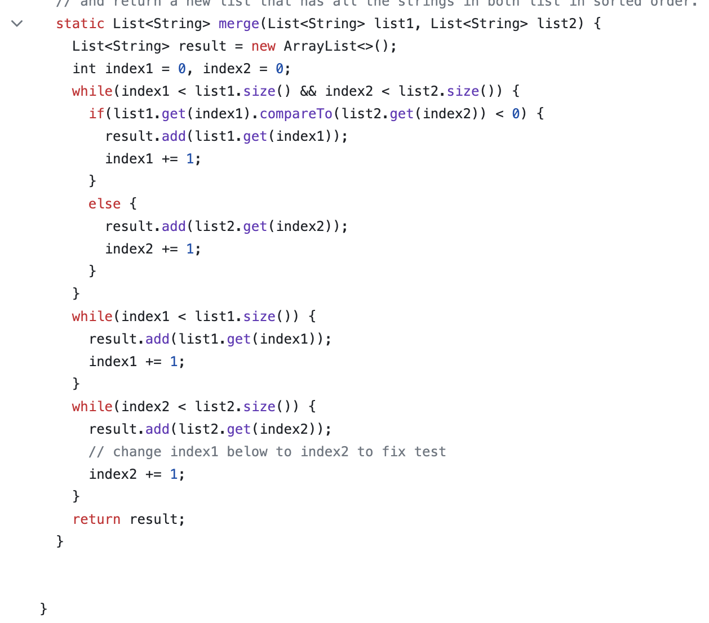

# LAB4 - REDO

## step1: Log into ieng6

SSH cs15lfa23gv@ieng6.ucsd.edu<enter>

use SSH command to Log in to the ieng6.ucsd.edu (I still use password because I can not set up my SSH KEY, I do not know why)

here is my SSH KEY set up(the password is same, but it always show Permission denied, please try again.): 

## step2: Clone your fork of the repository from your Github account (using the SSH URL)

git clone git@github.com:ZhixinShen03/lab7.git<enter>

use git clone command to clone the lab 7.

## step3: Run the tests, demonstrating that they fail

cd lab7<enter>

javac -cp .:lib/hamcrest-core-1.3.jar:lib/junit-4.13.2.jar *.java<enter>

java -cp .:lib/hamcrest-core-1.3.jar:lib/junit-4.13.2.jar org.junit.runner.JUnitCore ListExamplesTests<enter>

use cd command to get into the lab7 file, then run JUnit.

## step4: Edit the code file ListExamples.java to fix the failing test

vim<space>ListExamples.java<enter>

use vim command to enter file, then :44 <enter>, press<esc>, press i <enter>, <right><right><right><right><right><right><right> right click 7 times, Delete 2 and change it to 1, press<esc>, press :wq<enter> .

## step5: Run the tests, demonstrating that they now succeed

javac -cp .:lib/hamcrest-core-1.3.jar:lib/junit-4.13.2.jar *.java<enter>

java -cp .:lib/hamcrest-core-1.3.jar:lib/junit-4.13.2.jar org.junit.runner.JUnitCore ListExamplesTests<enter>

Run JUnit again, Test is OK.

## step6: Commit and push the resulting change to your Github account

git add ListExamples.java<enter>

git commit -mm "edited"<enter>

git push<enter>

Using git add "[filename]", then git commit -m "[commit message]", and git push to finish the task, and push the edit in github.

