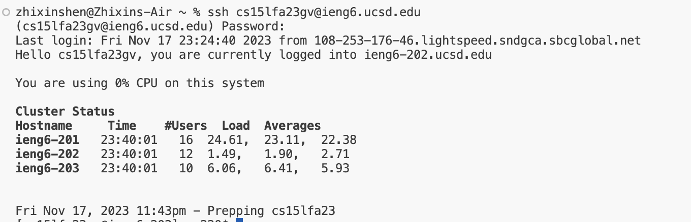
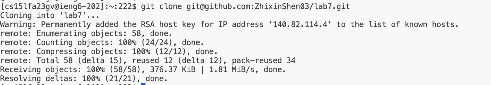
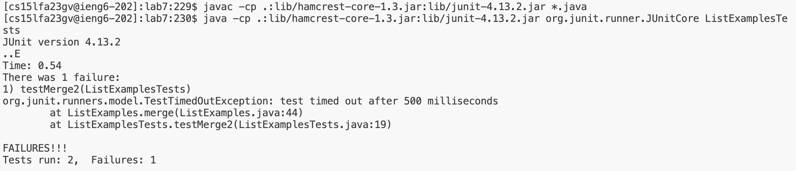
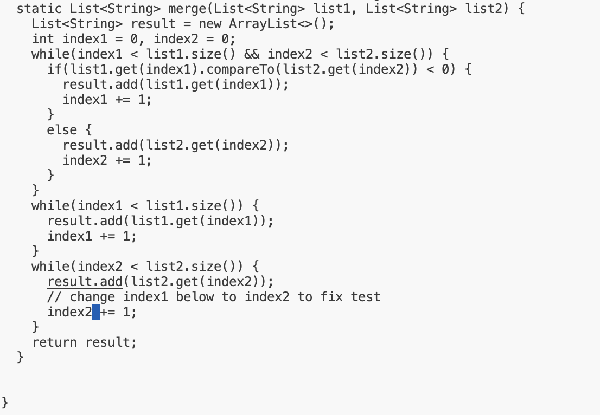
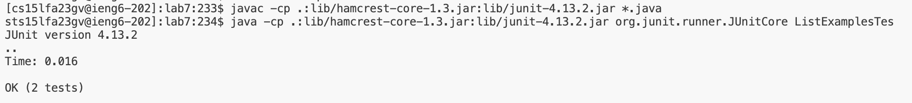
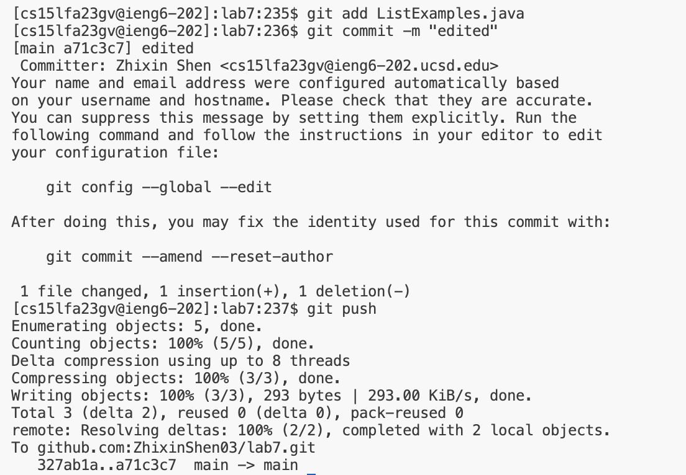

step1: Log into ieng6

Log in to the ieng6.ucsd.edu (I still use password because I can not set up my SSH KEY, I do not know why)

step2: Clone your fork of the repository from your Github account (using the SSH URL)

use git clone to the SSH link.

step3: Run the tests, demonstrating that they fail

use cd to get into the lab7 file, then run JUnit.

step4: Edit the code file ListExamples.java to fix the failing test

change index1 to index2, then Press ctrl + x to exit the file reading, then press Y and enter to save the file.

step5: Run the tests, demonstrating that they now succeed

Run JUnit again.

step6: Commit and push the resulting change to your Github account

Using git add "[filename]", then git commit -m "[commit message]", and git push to finish the task, and push the edit in github.

