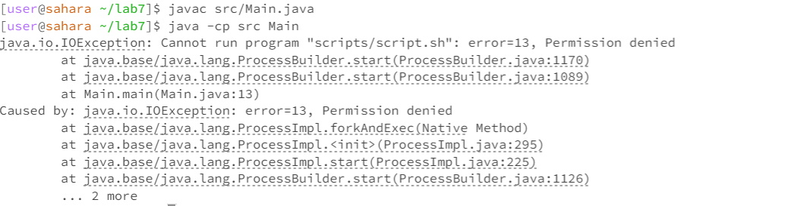
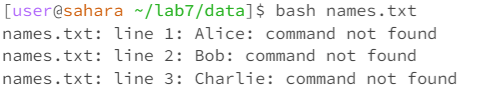
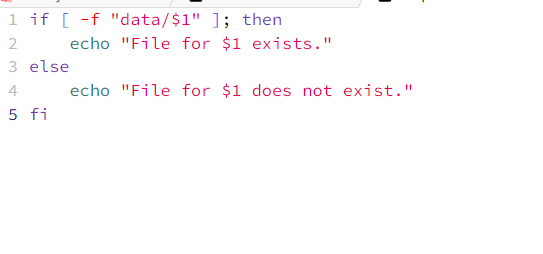
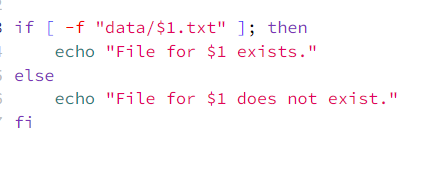
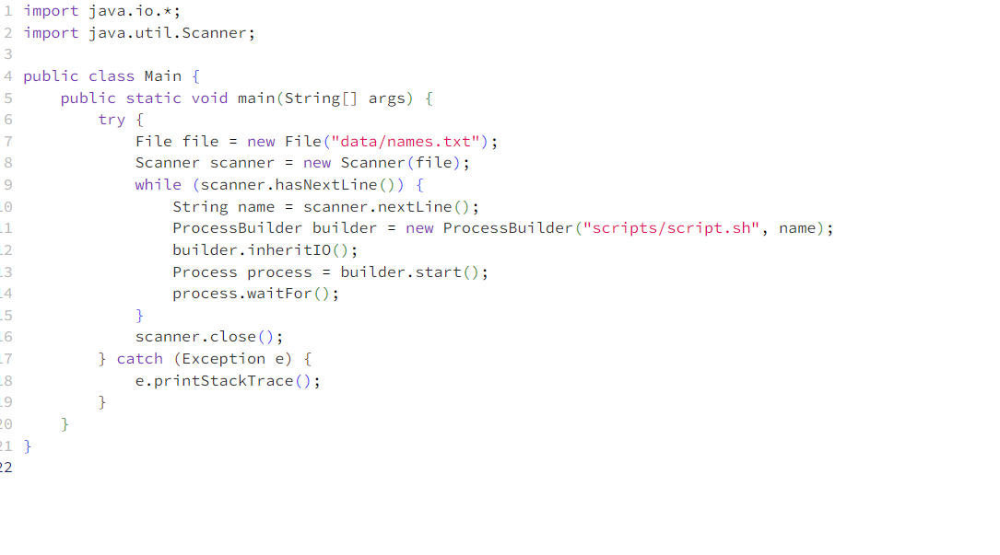

# Lab Report 5

## Part 1 – Debugging Scenario

Student:
Hello,
I'm currently working on a Java program that's supposed to read a list of names from 'names.txt' and pass each name to a bash script ('script.sh'). This script should check if a corresponding '.txt' file exists for each name in the 'data' directory. However, I'm encountering unexpected behavior where the script isn't listing files correctly. I suspect the issue might be in the way arguments are passed from Java to the bash script or in the script itself.

TA's Response:
To better understand the issue, could you try running the bash script independently with a name from your 'names.txt' file? Use this command in your terminal: `./scripts/script.sh <name>`. Replace `<name>` with a name from your list and share the output. This will help us determine if the script is functioning as expected on its own.

Student:
I followed your suggestion and ran the script with a hardcoded name. The script still didn't find the correct file, indicating that the problem lies within the bash script itself. Here's the output I received.

TA:
we are narrowing down the issue to the bash script. Now, let's focus on the `script.sh`. The script is supposed to check for the existence of a `.txt` file for each name in the `data` directory, but it seems to be failing in this task.

Student:

Thank you for the guidance. The issue was successfully resolved by correcting the file path in the bash script.

before fixing the bug:

after fixing the bug:

Main.java:

## Part 2 – Reflection

In the second half of this quarter, I have learned how to use the grep command, which has transformed the way I handle large sets of data. The grep command is highly useful for efficiently searching and extracting specific text patterns from files in my lab. With it, I can quickly find the file I need.

Vim has also proven to be invaluable. I can utilize the Vim command to locate specific files from a vast number of Java files, view them, and make modifications directly in the terminal. Prior to this, I had never used Vim in such a manner . Following these labs, I have gained some proficiency in using Vim to modify my code.

Additionally, in this class, I learned effective team task management. When dealing with numerous files, I can debug the code, I can now make code modifications, save the changes, and upload the code, allowing others to easily review my modifications. This skill has proven to be extremely useful.
